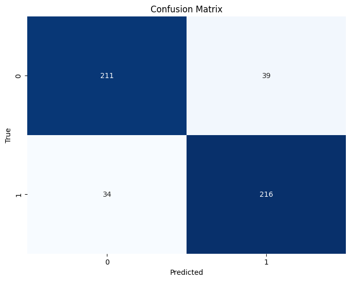
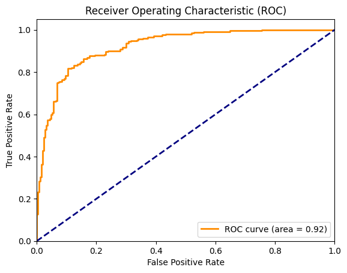
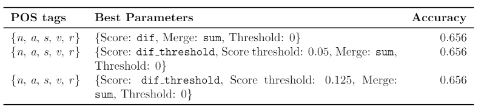
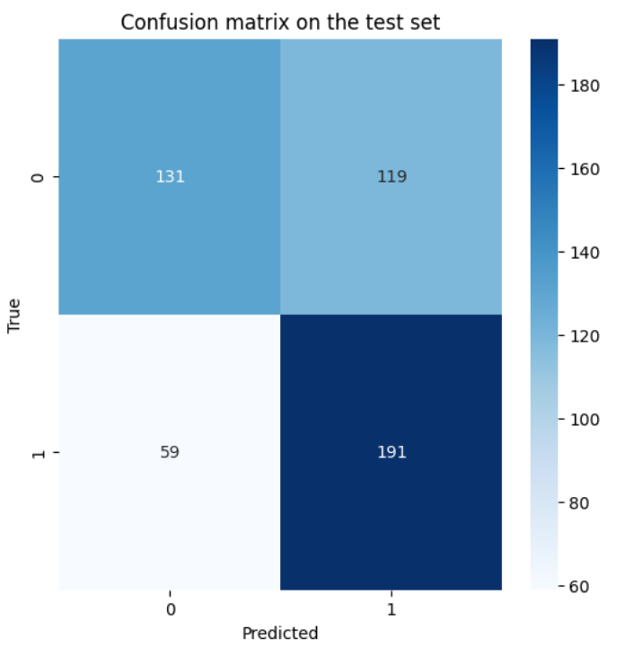
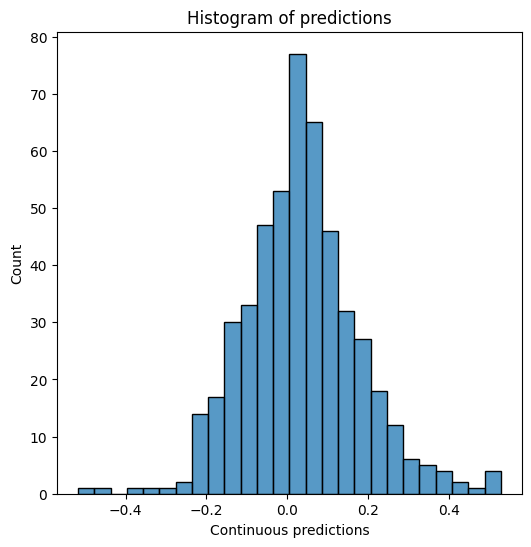
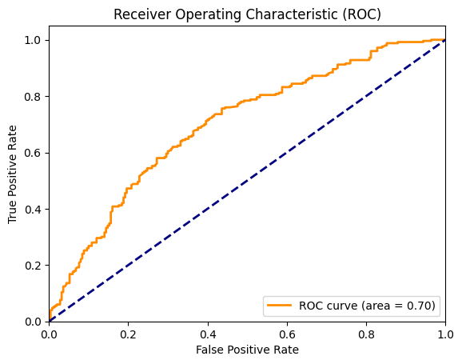

# Sentiment Analysis
> This repository contains the code and results from performing sentiment analysis on movie reviews. The project explores two different approaches to sentiment detection: one using *Bag of Words (BoW)* and **Supervised Learning**, and the other using *SentiWordNet* and **Unsupervised Learning** (knowledge-based).

## Table of Contents

- [Sentiment Analysis](#sentiment-analysis)
  - [Table of Contents](#table-of-contents)
  - [File structure](#file-structure)
  - [Data sources \& resources](#data-sources--resources)
  - [Supervised Learning](#supervised-learning)
    - [Results](#results)
  - [Usupervised Learning](#usupervised-learning)
    - [Pseudo-UKB](#pseudo-ukb)
    - [Obtaining a score](#obtaining-a-score)
    - [The best configuration](#the-best-configuration)
    - [Results](#results-1)
  - [Conclusions](#conclusions)

## File structure

The files and folders are organized the following way:

    ├── data
    │   ├── original_data
    │   ├── results
    |   └── synsets
    ├── media
    ├── compare_sup_unsup.ipynb
    ├── frequencies.py
    ├── split_dataset.py
    ├── supervised.ipynb
    ├── textserver.py
    ├── ukb_graph.gexf
    ├── ukb.py
    └── unsupervised.ipynb

- data: Contains the dataset, results, and synset data used in the project.
- media: Stores images and visualizations used in the README and reports.
- supervised.ipynb: Main notebook for the supervised learning approach.
- unsupervised.ipynb: Main notebook for the unsupervised learning approach.
- compare_sup_unsup.ipynb: Notebook comparing the results of the supervised and unsupervised approaches.
- ukb.py: Contains the pseudo-implementation of the UKB disambiguation algorithm.
- Other scripts: Assist with data processing and model evaluation.

## Data sources & resources

The data used was the [Movie Reviews Corpus](https://www.cs.cornell.edu/people/pabo/movie-review-data/), downloaded via nltk, consisting in 1000 positive and 1000 negative movie reviews (we have splitted in 25% test, 18.75% val and 56.25% train).

The supervised models make use of the library [scikit-learn](https://scikit-learn.org/stable/).

For the unsupervised part, [SentiWordNet](https://github.com/aesuli/SentiWordNet) is used, as well as [Spacy](https://spacy.io/) and our pseudo-implementation of [UKB](http://dx.doi.org/10.3115/1609067.1609070) (in the file ukb.py).

## Supervised Learning

The supervised learning approach involves preprocessing the text. We have selected three different methods: just calling CountVectorizer, lemmatizing and then CountVectorizer and binary CountVectorizer.

The models tried are:
- GradientBoosting
- AdaBoost
- RandomForest
- LogisticRegression
- SVC
- MLPClassifier

A **Grid Search Cross Validation** has been done in order to find the best model (accuracy) with the best params. This took +100 minutes.

### Results
The best model ended up being a *RandomForest* with 1500 estimators, max depth 14 and using the binary Count Vectorizer (0.8613 accuracy val). With the test partition, the obtained accuracy was **0.854**.

  
  

## Usupervised Learning

The first step for this part was to do synset disambiguation, so we could later on use SentiWordNet. We have tried three different ways of performing this task:
- Using POS tagging and Lesk algorithm
- Using a custom implementation of UKB
- Using the most freqüent synset (based on SemCor)
  
### Pseudo-UKB

**UKB** is a SOTA word sense disambiguator, described on [this paper](http://dx.doi.org/10.3115/1609067.1609070), [this other](https://arxiv.org/abs/1805.04277)... by the IXA group of the University of the Basque Country (you can find more information [here](https://ixa2.si.ehu.eus/ukb/)).

In our pseudo-implementation, we revised the different methods described in their paper, using the library networkx (UKB uses PageRank). However, at the end we couldn't use this method for all the dataset, since it was too slow, and we only tested it with a subset of the data.

### Obtaining a score

With the synsets, we can use **SentiWordNet** to obtain a *polarity score* of each word (pos, neg or obj). However, we can get some other metrics from this scores, like the max score, the difference between pos and neg, difference with a threshold... You can also filter word using their POS tag, like only using nouns, adjectives...

We can also use different methods to get the scores of a sentence: sum, mean, max, min, norm2 mean... To join different sentences, we decided to just use the mean.

Finally, with the score of a review, we still need to determine a threshold upon which we decide that score to be positive.

### The best configuration

We have created a "validation" partition to test all the different ways to calculate the scores. The whole search took 170 minutes, and these are the best performing ones:

  

### Results

The final configuration chosen was using all POS except verbs, score dif, merge using sum and threshold 0. The accuracy was **0.644**.

  
  
  

Other alternatives were also tried to try to obtain better results (VADER, negation detection...) but they ended up being worse.

## Conclusions
It is pretty clear that, even though the unsupervised learning techniques could generate some predictions, the supervised approach obtained much better results.

However, with the use of bigger models, embeddings, and architectures like Transformers, this results could be further improved. 